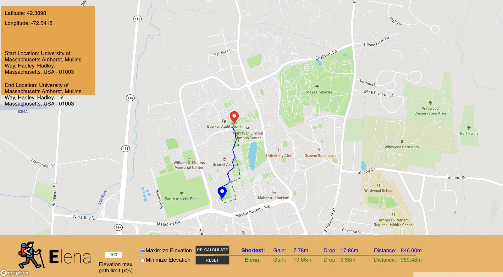

# Elevation Based Navigation System (EleNa)
Elevation Based Navigation System (EleNa) is a web application that aims to provide users hiking/trekking routes between any two points on a map. The routes can be tuned to either maximize or minimize elevation and the user can specify the percentage of elevation. EleNa provides a traditional shortest path route as well. 

# Installation and set up

### Requirements
The application has the following requirements -
1. osmnx (0.11.4)
2. networkx (2.4)
3. Flask (1.1.1)
4. numpy (1.18.1)
5. geopy (1.21.0)

The requirements can be installed with pip

pip install -r requirements.txt

# Running and testing the application

### Using the application
- Clone the git repository from `GIT LINKKKKKKKKKKKKKK`
- Make `start` an executable by running `chmod +x start`
- ./start To start up the application. 
- Head over to `http://127.0.0.1:5000/home` on preferably Google Chrome to use the web interface.

### Interacting with the UI
- The start and end points can be set by clicking on the map.
- The percentage (x%) of shortest distance that the user wants to go extra can be entered in the entry field.
- The corresponding radio buttons for the minimization or maximization of elevation can be selected. 
- Once all the inputs are given, clicking the "Calculate" button will display the computed shortest path in blue and the path with elevation in red.
- Statistics about the path will also be shown on the UI. 
- Clicking the "Reset" button will clear the UI of all inputs and paths. 
- To make any change to inputs such as source, destination or x% the user should "Reset" the UI then enter the updated values and click on "Calculate" button to recompute the paths.

### Back-end Logic

- The backend computes the paths using two algorithms - Dijkstra and A* algorithm. 
- The shortest path is the taken

The final path returned is the best of the two for the given elevation data. 
- Assuming the user will select points around Amherst, the map has been centered around Amherst. A new "graph.p" file has to be updated if the desired location is different. 

### The Tech stack
Our Tech stack has two components : Front End and Back End as shown in the figure below:

## Architecture

This web application is designed in a Model-View-Controller (MVC) architecture with the following components: 

- `Elena/abstraction/abstraction.py` - Model
- `Elena/control/control.py` and `Elena/control/algorithms` - Controller
 - `Elena/home/templates/home.html` - View

### Usability
- We tried to implement a simple layout and that's intuitive to understand and interact with.
- All the required information is provided in a clear and concise manner. The design and UI is comprehensive and pleasing to the eye. 

### Understandability
- Comprehensive comments have been added to improve Readability of code.
- Effective naming conventions have been used for variables, functions and classes. 
- Functions and classes were used wherever possible to ensure Single Responsibility Principle. 

### Accessibility 
- We used popping and contrasting color for easier visibility.
- Larger fonts make it easier for users with vision difficulties to use the application.  
- Intuitive UI allows users with cognitive impairments easily make use of the application.   
- Alt texts on images allow screen readers to read the content. 

### Design Principles

The following design principles were followed:

- Single Responsibility Principle: The classes for graph model and functions for the algorithm were created such that they have their own responsibility and purposes. 
- Open Principle: Our shortest path algorithm is Open for improvements. We have used Dijkstra and A* algorithms for our computations but if a different algorithm is to be used, it can easily be integrated with our application. 
- Dependency Inversion Principle : We have constructed an abstract class which supports the high level and low level models.

### Testing 

We have written our own custom test method which lets you know if a condition has passed or failed.

Testing `abstraction.py`:
-   `test_graph_getter `- Checks if graph is generated.

Testing `control.py`:
-   `test_get_geojson_coor` - Checks if input dictionary is generated correctly.
-   `test_get_data_points` - Checks if data points are generated for computing the routes.

Testing `algorithms.py`:
-   `test_get_route` - Given a parent node and destination, checks if the path is generated correctly.
-   `test_get_shortest_path` - Given source and destination, checks if the shortest path is computed correctly.
-   `test_get_Elevation` - Checks the cost returned for a particular route given elevation_drop , elevation_gain.
-   `test_get_cost` - Checks whether the best cost is returned given various conditions.

## Debugging
-   Breakpoints were added to check for debuggability of the code.   
-   Logging statements inserted throughout the code help in debuggability.  
-   Precondition checks allow for checking valid values.

# Exterminators_520

- `Rohan Lekhwani`
- `Arunima Sundar`
- `Kalyani Patle`
- `Anirudh Lakkaraju`

